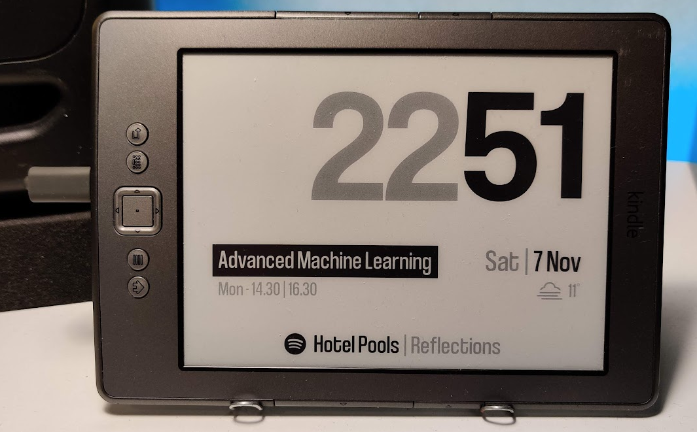

 

There are many tutorials on the web on how to convert your old Kindle into a clock or a weather station, but many of them rely on the integrated browser to display contents. This is a big limitation in my opinion, since you need an external device where you have to host a website that will displayed on the Kindle. Moreover, the browser cannot be set on fullscreen mode and therefore the top bar will always be visible.

The Kindle is essentially a device powered by Linux, and thanks to the jailbreak, we can have access to the full system via SSH. So why don't we take advantage of the (little) computational power of the e-reader to generate all the contents to display locally?

The MobileRead forum has a lot of mods to install on a jailbroken Kindle, in this case the Python package comes really handy. With Python installed, we can run virtually any script we want (while keeping in mind the limitation of the e-reader). Combine that with a little of custom commands and you can display images generated locally. You can display data about weather informations, your current song playing on Spotify, what events are planned today and more! The potential is endless.

## About this project
I will admit that i had this project *almost* ready for more than 2 years now (even though I've been using my Kindle as a desk clock since then). It also went through various iteration, I implemented different features and then scratched others, i reworked the whole codebase at least two times.
But being the perfectionist I am, it took me this long to finally write an article about this project and finalize it.

|  | 
|:--:| 
| *A Kindle displaying random comics from xkcd!* |

Even though I tried to explain the process in details, the solution isn't plug and play and requires a little bit of tinkering and familiarity with Linux and the command line. My final goal was to realize a modular solution in the most easily installable "package". But I've decided that the work I had to put for reaching my perfect goal wasn't really worth, so I opted for creating an exhaustive guide on how to realize something like this yourself, using my code as a starting point.
Keep in mind that this is still work in progress! I would like to develop this project further, since there is a lot of room for improvements and features I'd love to add.
Let's dive into it!

## The perfect dashboard
|  | 
|:--:| 
| *I know I have a bad sense of humor, but this is how I use it daily.* |
Work in progress!

## How to setup
### 1. What you will need
This project is based on the **4th generation Kindle**, with **firmware 4.1.4**. I haven't tested this on any other firmware version or device. You also need a PC for jaibreaking the device and to connect via SSH.

### 2. Jailbreaking your Kindle
Warning! This procedure can brick permanently your device, so follow at your own risk. I'm not responsible if your Kindle doesn't turn on anymore. All the necessary files are available in the `bin.zip` file in my repository.

* Plug in the Kindle and copy the content of the `jailbreak` folder in `bin.zip` to the Kindle's USB drive's root 
* Safely remove the USB cable and restart the Kindle (Menu button -> Settings -> Menu button -> Restart)
* Once the device restarts into diagnostics mode, select "D) Exit, Reboot or Disable Diags" (using the 5-way keypad) 
* Select "R) Reboot System" and "Q) To continue" (following on-screen instructions, when it tells you to use 'FW Left' to select an option, it means left on the 5-way keypad) 
* Wait about 20 seconds: you should see the Jailbreak screen for a while, and the device should then restart normally 
* After the Kindle restarts, you should see a new book titled "You are Jailbroken", if you see this, the jailbreak has been successful

### 3. Enabling SSH
Congratulation! You have successfully jailbroken your device. Now we have to enable SSH to take full control of the system.
* Plug in the Kindle and copy the content of the `usbnetwork` folder in `bin.zip` to the Kindle's USB drive's root
* Safely remove the USB cable and update the Kindle (Menu button -> Settings -> Menu button -> Update Your Kindle)
* Once the device restarts, plug in the Kindle and setup your public key in `usbnet/etc/authorized_keys`
* Edit `usbnet/etc/config` and set `K3_WIFI="true"` and `USE_OPENSSH="true"`
* Safely remove the USB cable
* Test if the connection via SSH works
    * Press the keyboard key on the Kindle and write `;debugOn` followed by enter
    * Press the keyboard key on the Kindle and write `~usbNetwork` followed by enter
    * Now try connecting to the Kindle via SSH (with root user)
* If SSH connection works, enable USBnetwork at system startup by creating a blank `auto` file in the `usbnet` folder 
    * You can use the command `touch /mnt/us/usbnet/auto`
    * Warning: this will disable USB mass storage, so be sure that everything is working as it should!
* Reboot the device and test if SSH works at startup

### 4. Installing Python and screen
Now that we can access the device in SSH, we have to install Python and screen in order in order to make the software work. Python is used to run the program, while screen is used to run it detached from the SSH session.
* Plug in the Kindle and copy the content of the `python` folder in `bin.zip` to the Kindle's USB drive's root (`/mnt/us/`)
* Update the Kindle (Menu button -> Settings -> Menu button -> Update Your Kindle)
* Once the device restarts, install pip by running `python3 -m ensurepip --upgrade`
* Copy the content of the `screen` folder in `bin.zip` to `/mnt/us/bin`
* Run `mntroot rw` to make the root filesystem writeable
* Create a symlink for using screen system-wide `ln -s /mnt/us/bin/screen /usr/bin/screen`

### 5. Installing and running the software
* Clone the repository in `/mnt/us/dashboard`
* Install requirements by running `python3 -m pip install -r /mnt/us/dashboard/requirements.txt`
* Run `/mnt/us/dashboard/start.sh`

Wait a few seconds and everything should hopefully work as expected!

### 6. Updating the time
* To syncronize clock: `ntpdate 0.it.pool.ntp.org`
* If you want to change the timezone, you must edit `/etc/localtime`
    * Copy the timezone file you want from a Linux system (for example: `/usr/share/zoneinfo/Europe/Rome`) to /mnt/us/
    * Remove the old symlink `rm /etc/localtime`
    * Create a symlink to the new timezone: `ln -s /mnt/us/Rome /etc/localtime`

### 7. Start the script at boot
* Run `mntroot rw` to make the root filesystem writeable
* Edit `/etc/init.d/boot_finished` and add `/mnt/us/dashboard/start.sh` before `return 0` of the `after_framework_start()` function

## Possible improvements
* WiFi seems to stop working after some weeks but I currently don't know why. It may be a solution to schedule a device reboot every once in a while (or maybe just the network)
* Make it possible to set timezone from configuration

## Some old iterations and concepts
 

## Sources
* Kindle jailbreak: https://wiki.mobileread.com/wiki/Kindle4NTHacking#Jailbreak
* USBNetwork: https://www.mobileread.com/forums/showthread.php?t=88004
* Python: https://www.mobileread.com/forums/showthread.php?t=225030
* screen: https://www.fabiszewski.net/kindle-terminal/